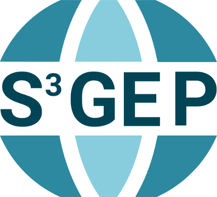

# S3-GEP - Scalable Spatiotemporal Statistics for Global Environmental Phenomena

This website presents the _S3-GEP_ research project funded by the German Research Foundation (DFG) under project number 396611854.

## Project summary
With today's amount of open Earth observation data, comprehensive geostatistical analyses of environmental phenomena can be brought to global scale. However, computational complexity of random field operations, globally unrealistic model assumptions like stationarity, separability, and isotropy, and data management issues when data size exceeds local storage capacity currently limit the practical use of the data in statistical applications and result in unshareable, irreproducible research. As an example, using global elevation data in the order of a few terabytes as covariate information in modeling the spatial variation of precipitation requires fast methods to inferential statistics and extensive effort in data management. In this project, we aim at developing efficient methods for geostatistical inference on global environmental phenomena that 

1. computationally scale well on shared nothing architectures, 
2. consider non-stationary, non-separable, and anisotropic spatiotemporal dependencies, and 
3. are capable of integrating multiple data sources including remote sensing imagery and in-situ observations.

Therefore, we will build geostatistical models that combine spatial Markov random fields with temporal advection-diffusion processes and adapt novel algorithms to the highly scalable data management and analytics system SciDB. Developed methods will be demonstrated in two use cases including the creation of a global high resolution precipitation dataset and global modeling of land use change with external independent variables. 
Expected key contributions include algorithms for efficient geostatistical inference in distributed computing environments, approaches for modeling non-stationarity and anisotropy on global scale, and open source software tools for reproducible large-scale environmental data management and analyses.

## Introduction

## Objectives

## Methods

## Use cases